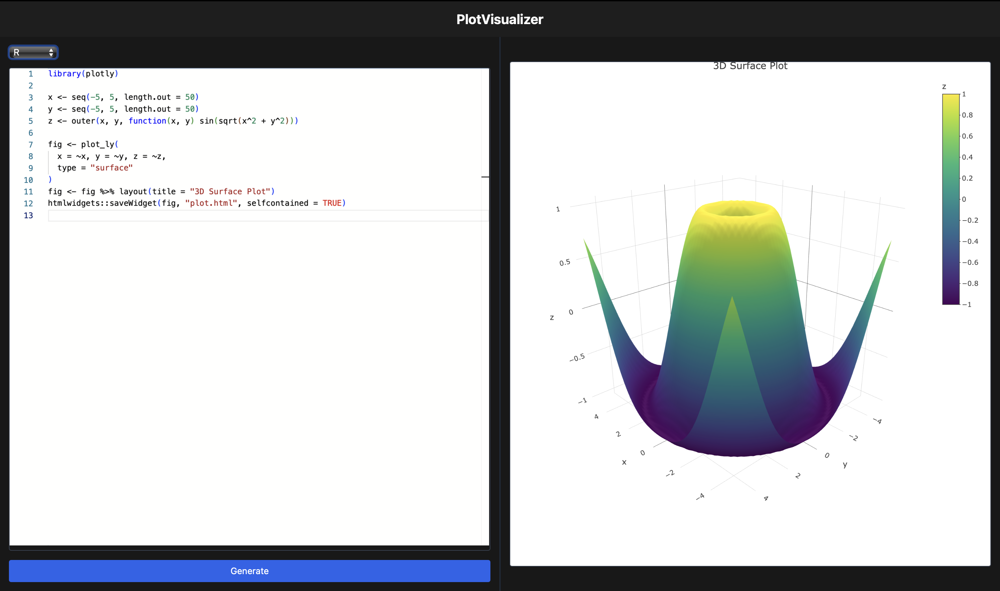
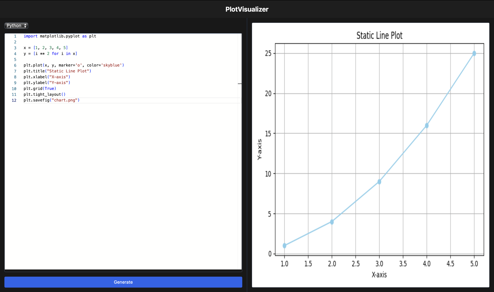
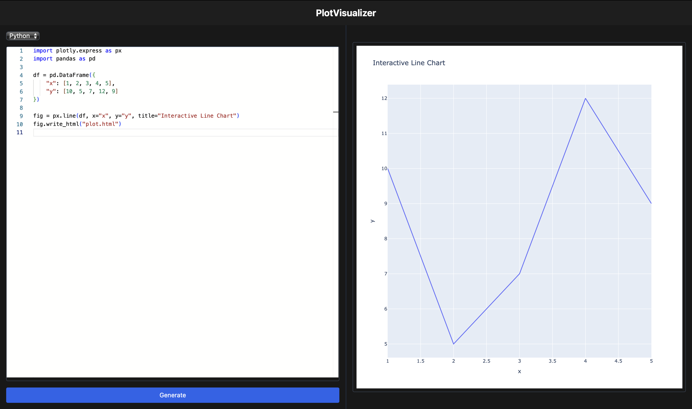

# PlotVisualizer - A Web Application to visualize static, interactive and dynamic (3D) Plots

## Overview

* Plot Visualizer provides a web interface to visualize plot of python and R language. This platform support below types of libraries from each of the language. 

| Language | Libraries |
| -------- | --------- |
| Python   | matplotlib, seaborn,  plotly,  numpy,  pandas |
| R        | plotly, htmlwidgets, ggplot2 |

* It supports static, interactive and 3D plots for both languages.

## Design and tools Used

| Component | Tools |
| -------- | --------- |
| Frontend   | ReactJS, Axios, Monaco Code Editor |
| Backend        | FastAPI, Docker |

## How to Setup a Project.

### Frontend

* Clone the repository. 
* Open new terminal window and execute `cd frontend`.
* Ensure that your machine has a node package manager. Whether node package manager is installed or not. check by executing `npm --version` command.
* After that, execute `npm init` command.
* In order to start development server execute `npm run start` command.

### Backend

* Open new terminal window and execute `cd backend`.
* Ensure that your machine contain python interperator. Whether python is installed or not. check by executing `python --version` or `python3 --version` command.
* Create virtual environment by following command: `python -m venv <environment-name>`.
* Activate virtual environment by execute: `source <environment-name>/bin/activate`.
* After activating virtual environment execute: `pip install -r requirements.txt`.
* Also ensure that your machine has a docker desktop installed.
* Start docker desktop and run following commands:
  ```yaml
    docker build -t viz-python:latest -f Dockerfiles/Dockerfile.python .
  ```
  ```yaml
    docker build -t viz-r:latest -f Dockerfiles/Dockerfile.r .
  ```
* Run `fastapi run main.py --reload` in order to start FastAPI development server.

## Challenges Faced

1. How to isolate execution of each and every submission and how to restrict time limit on code execution?
*  Currently, our code starting docker container according to respective language and runs code on that container. As well as we had impose 15 sec time limit on code execution. so it will not consume extra resources from our machine.

2. How to store file output?
* Our program always contain instruction for save fig and save chart but we have to handle in backend our own. So I have created `/output` directory in root directory of backend and mount that directory into docker container. So when output saved in docker container it will also saved in our local machine `/output` directory.

3. How to render charts?
* I had used static files concept of FastAPI in order to serve static files from our backend. This way I am easily able to return output figures to frontend.

## Screenshots of platform





## Recording

* [Demo Link](https://drive.google.com/drive/folders/1ly6Yn5gZ2pgZ19PtSQs38WkaAsgRUV7S?usp=sharing)

## Contributor

[Dev Patel](mailto::dap3@iu.edu)